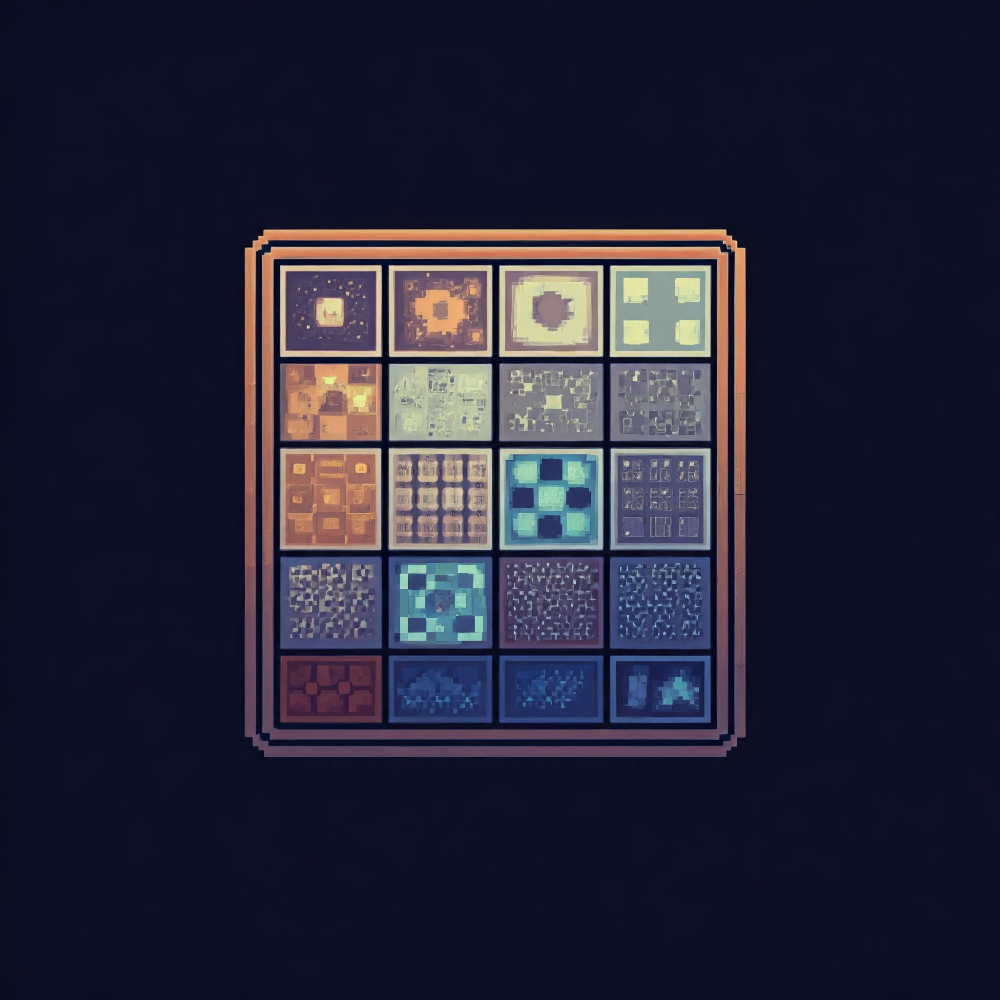

# GameOfLife_DropTables


## Live
Grab your OS version from [Releases Page](https://github.com/Madiocre/GameOfLife_DropTables/releases)

## Screenshots


## Table of Contents

1. [Introduction](#introduction)
2. [Features](#features)
3. [Technology Stack](#technology-stack)
4. [Project Structure](#project-structure)
5. [Development](#Development)
6. [Setup and Installation](#setup-and-installation)
7. [Running the Application](#running-the-application)
8. [License](#license)

## Introduction

Game Of Life Python remake using tkinter By Droptables

## Features

- Responsive design for various screen sizes
- Custmoizable game play
- muliple colors
- audio feedback
- Ready packaged builds


## Technology Stack

- Tkinter
- pygame (audio handling)

## Project Structure

```text
.
├── Dockerfile
├── LICENSE
├── README.md
├── assets
│   ├── img
│   │   └── logo.jpg
│   └── music
│       ├── s1.wav
│       ├── s2.wav
│       └── s3.wav
├── gol.py
├── main.py
├── main.spec
├── requirments.txt
├── utils.py
└── whdog.py

3 directories, 13 files
```

## Development
- Set up python3-tk `sudo apt install python3-tk`
- install requirments `pip3 install -r requirments.txt`
- Run `python3 whdog.py` For hot reloads

## Setup and Installation

1. Clone the repository:
   ```sh
   git clone https://github.com/Madiocre/GameOfLife_DropTables/
   cd GameOfLife_DropTables
   ```
2. Set up a virtual environment:

   ```sh
   python -m venv venv
   source venv/bin/activate  # On Windows use venv\Scripts\activate
   ```
3. Set up python3-tk:
   - `sudo apt install python3-tk`

4. Install requirments:
   - `pip3 install -r requirments.txt`


## Running the Application

   - `python3 main.py`

## Building
- make sure you have all requirments installed (See last section)
- On linux run `pyinstaller --onefile --add-data "./assets:assets"  --hidden-import "PIL._tkinter_finder" --windowed main.py`
- On windows run `pyinstaller --onefile --add-data "assets;assets"  --hidden-import "PIL._tkinter_finder" --windowed main.py`
- Your build should be in `dist/` folder

Enjoy :D

## Authors

- Noor Amjad - [GitHub](https://github.com/Justxd22) / [Twitter](https://twitter.com/_xd222) / [LinkedIn](https://www.linkedin.com/in/noor-amjad-xd)
- Amr Abdelfattah - [GitHub](https://github.com/0x3mr) / [Twitter](https://twitter.com/an0n_amr) / [LinkedIn](https://www.linkedin.com/in/amrabdelfattah/)
- Ahmed Shalaby - [GitHub](https://github.com/Madiocre) / [Twitter](https://twitter.com/Ahmed_K_Shalaby) / [LinkedIn](https://www.linkedin.com/in/ahmed-shalaby-31a03a235/)
- Ahmed Aboalesaad - [GitHub](https://github.com/Ahmed-Aboalasaad) / [Twitter](https://x.com/Aboalesaad_) / [LinkedIn](https://www.linkedin.com/in/ahmed-aboalesaad/)
- Abdelrahman Mohamed - [GitHub](https://github.com/hackerSa3edy) / [Twitter](https://x.com/hackersa3edy) / [LinkedIn](https://linkedin.com/abdelrahmanm0)
- Kedir Jabir - [GitHub](https://github.com/IbnuJabir) / [Twitter](https://x.com/Ibnu_J1) / [LinkedIn](https://www.linkedin.com/in/ibnu-jabir/)

## License

Copyright (C) 2024
Licensed under the GPLv3 License
