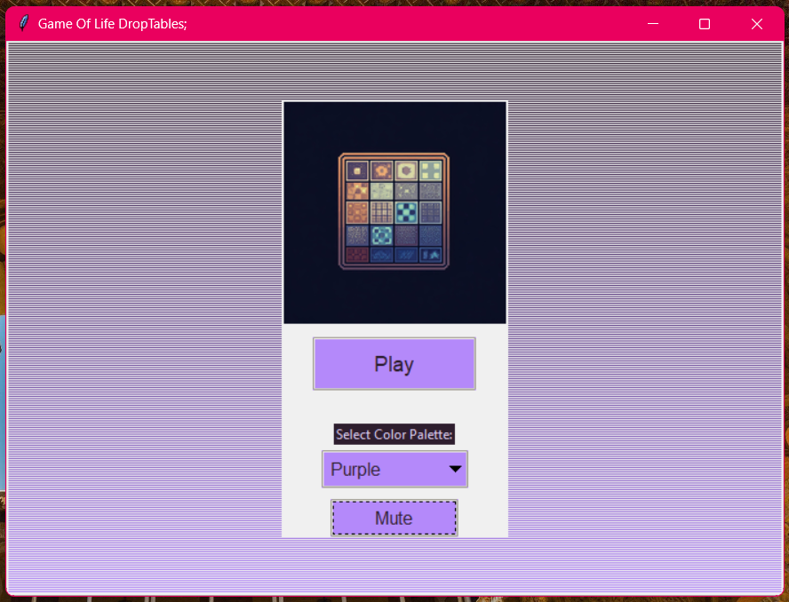
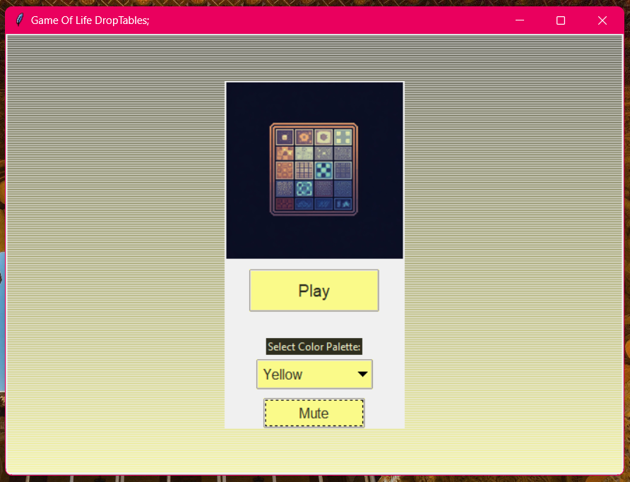
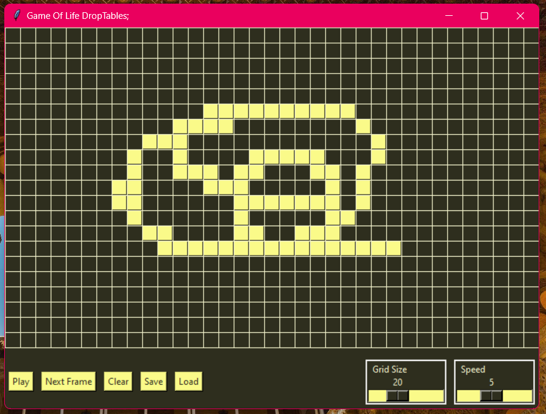
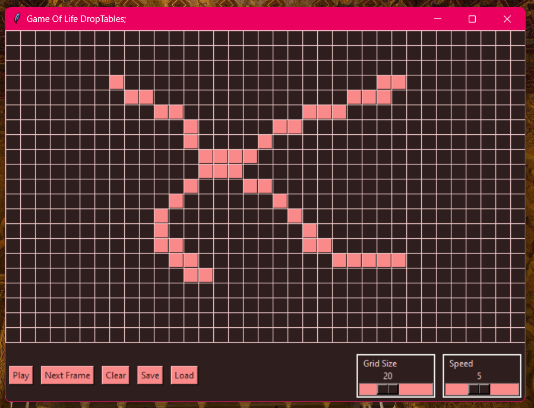
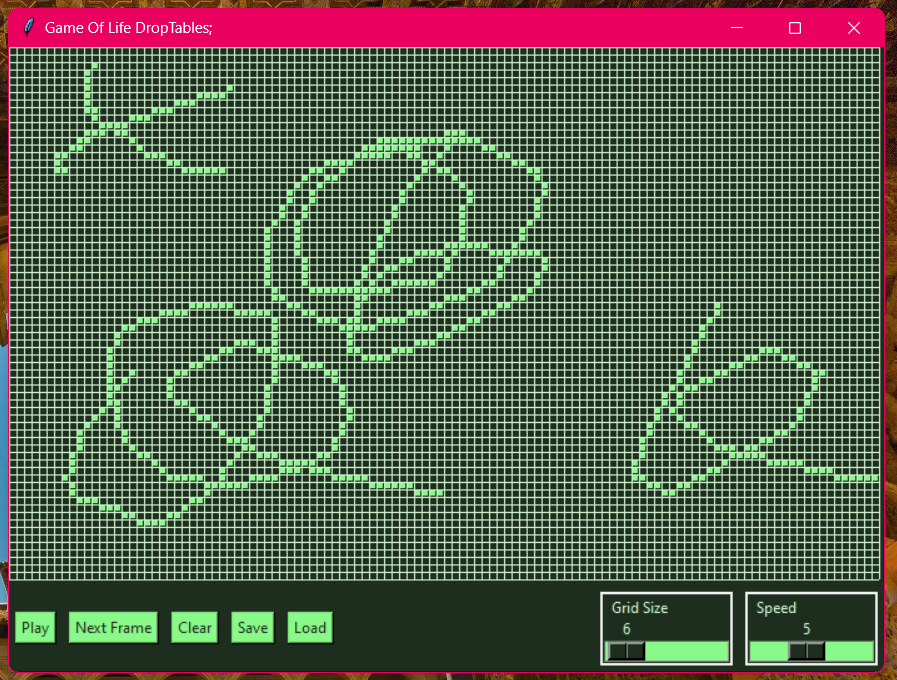

# GameOfLife_DropTables


## Live
Grab your OS version from [Releases Page](https://github.com/Madiocre/GameOfLife_DropTables/releases)

## Screenshots






## Table of Contents

1. [Introduction](#introduction)
2. [Features](#features)
3. [Technology Stack](#technology-stack)
4. [Project Structure](#project-structure)
5. [Development](#Development)
6. [Setup and Installation](#setup-and-installation)
7. [Running the Application](#running-the-application)
8. [License](#license)

## Introduction

Game Of Life A Python Desktop App using Tkinter By Droptables

This project is an interactive desktop application simulating John Conway’s Game of Life, a famous cellular automaton. The game consists of a grid of cells that evolve from generation to generation based on a set of simple rules. Each cell can either be alive or dead, and its state in the next generation is determined by the state of its neighboring cells.

The objective of this project is to bring Conway's Game of Life to life using Python's Tkinter library, creating a visually appealing and user-friendly interface. The app not only showcases the beauty of emergent patterns through the game’s evolution but also allows users to experiment with custom patterns, explore boundary conditions, and control the simulation speed.

This project emphasizes code structure, Tkinter usage, and visual design to provide an engaging experience for users, offering customization and interactivity at every step.

## Features

- Responsive design for various screen sizes
- One click Drag to fastly select boxes
- Resizable window
- Game speed controls
- Grid size controls
- Customizable game play
- Muliple colors / New look every start
- Audio feedback
- Ready packaged builds on every push
- Linux + Windows Support


## Technology Stack

### python packages
- Tkinter (main gui framework)
- pygame (audio handling)
- pyinstaller (packaging)
- pillow (image handling)
- watchdog (hot reload for devs)
- json
- random
- os

### other
- github workflows (Building and Releases)
- github actions (triggering new builds)


## Project Structure

```text
.
├── LICENSE
├── README.md
├── assets
│   ├── img
│   │   └── logo.png
│   └── music
│       ├── lofi.mp3
│       ├── s1.wav
│       ├── s2.wav
│       └── s3.wav
├── gol.py
├── main.py
├── main.spec
├── requirments.txt
├── utils.py
└── whdog.py

3 directories, 13 files
```

## Development
- Set up python3-tk `sudo apt install python3-tk`
- install requirments `pip3 install -r requirments.txt`
- Run `python3 whdog.py` For hot reloads

## Setup and Installation

1. Clone the repository:
   ```sh
   git clone https://github.com/Madiocre/GameOfLife_DropTables/
   cd GameOfLife_DropTables
   ```
2. Set up a virtual environment:

   ```sh
   python -m venv venv
   source venv/bin/activate  # On Windows use venv\Scripts\activate
   ```
3. Set up python3-tk:
   - `sudo apt install python3-tk`

4. Install requirments:
   - `pip3 install -r requirments.txt`


## Running the Application

   - `python3 main.py`

## Building
- make sure you have all requirments installed (See last section)
- On linux run `pyinstaller --onefile --add-data "./assets:assets" --icon="assets/img/logo.png" --hidden-import "PIL._tkinter_finder" --windowed main.py`
- On windows run `pyinstaller --onefile --add-data "assets;assets" --icon="assets/img/logo.png" --hidden-import "PIL._tkinter_finder" --windowed main.py`
- Your build should be in `dist/` folder

Enjoy :D

## Authors

- Noor Amjad - [GitHub](https://github.com/Justxd22) / [Twitter](https://twitter.com/_xd222) / [LinkedIn](https://www.linkedin.com/in/noor-amjad-xd)
- Amr Abdelfattah - [GitHub](https://github.com/0x3mr) / [Twitter](https://twitter.com/an0n_amr) / [LinkedIn](https://www.linkedin.com/in/amrabdelfattah/)
- Ahmed Shalaby - [GitHub](https://github.com/Madiocre) / [Twitter](https://twitter.com/Ahmed_K_Shalaby) / [LinkedIn](https://www.linkedin.com/in/ahmed-shalaby-31a03a235/)
- Ahmed Aboalesaad - [GitHub](https://github.com/Ahmed-Aboalasaad) / [Twitter](https://x.com/Aboalesaad_) / [LinkedIn](https://www.linkedin.com/in/ahmed-aboalesaad/)
- Abdelrahman Mohamed - [GitHub](https://github.com/hackerSa3edy) / [Twitter](https://x.com/hackersa3edy) / [LinkedIn](https://linkedin.com/abdelrahmanm0)
- Kedir Jabir - [GitHub](https://github.com/IbnuJabir) / [Twitter](https://x.com/Ibnu_J1) / [LinkedIn](https://www.linkedin.com/in/ibnu-jabir/)

## License

Copyright (C) 2024
Licensed under the GPLv3 License
